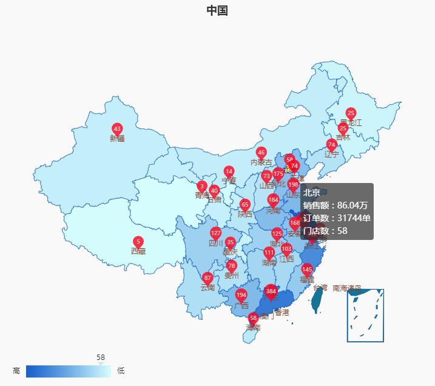
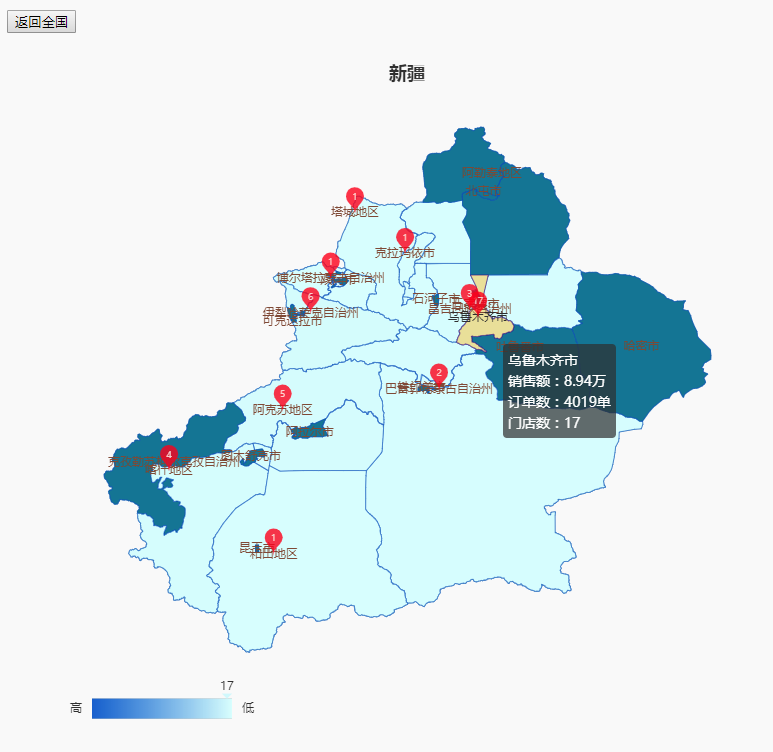

# Echarts-China-Map

#### 介绍

中国地图及省份联动，根据数据显示气泡、提示，目前固定新疆的省份可以显示数据，其余省份可根据请求获取。

option基本都是[echarts](https://echarts.baidu.com/)官网的API，目前官网不提供china.js,但是，根据需求，现在的地图不能满足，所以还是使用了以前的版本。

#### 项目依赖

echarts3、map、china.js

